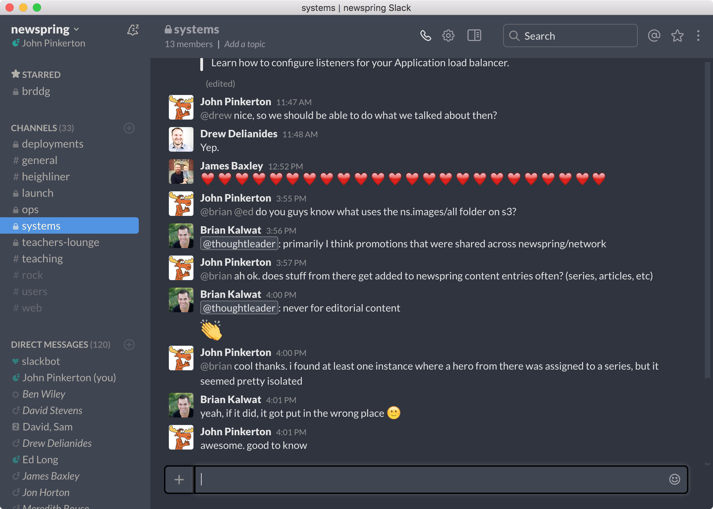

# Dark Slack



Yes, a real dark theme for Slack. But, you have to build it yourself. It's so easy!

This is great for those of us with bleeding eyes, the only downfall is that since we are wrapping the web app you will lose the organization switcher on the left side. However, you can still easily sign in to multiple organizations and switch using command-K.

```
git clone https://github.com/johnthepink/dark-slack.git
cd dark-slack
npm install -g nativefier
nativefier https://[your-org].slack.com --inject darkslack.css --name "Dark Slack" --icon slack.icns
```
